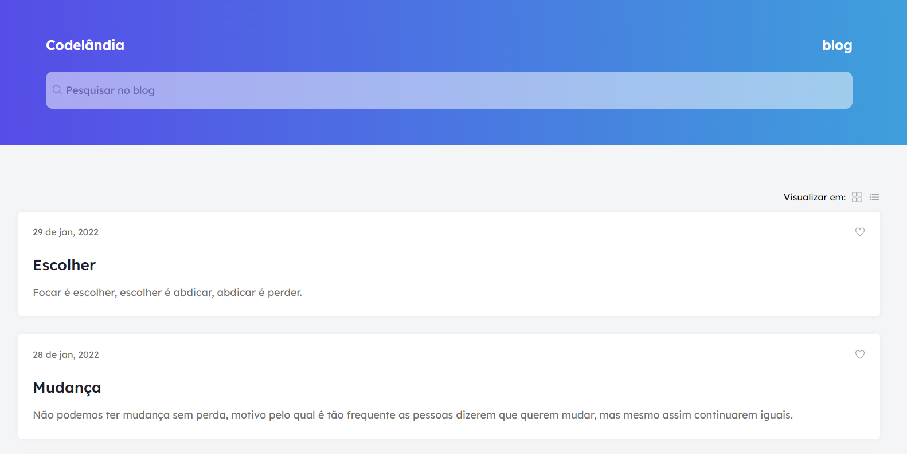

# Desafio 01 da comunidade Codelândia

Conceitos abordados no projeto:

* Transformação de um layout do Figma em código
* Media queries
* Layout em colunas
* Implementação de tipos de visualizações diferentes lista ou grade

### [Link para conferir o resultado](https://brendacosta.github.io/desafios---Codelandia/01BLOG/index.html)
