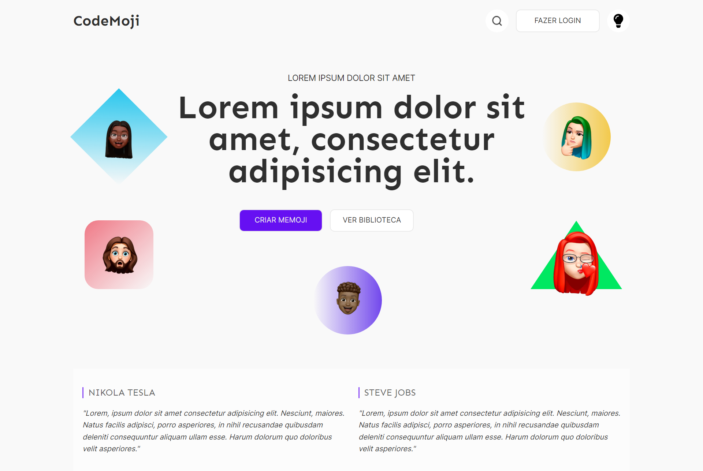
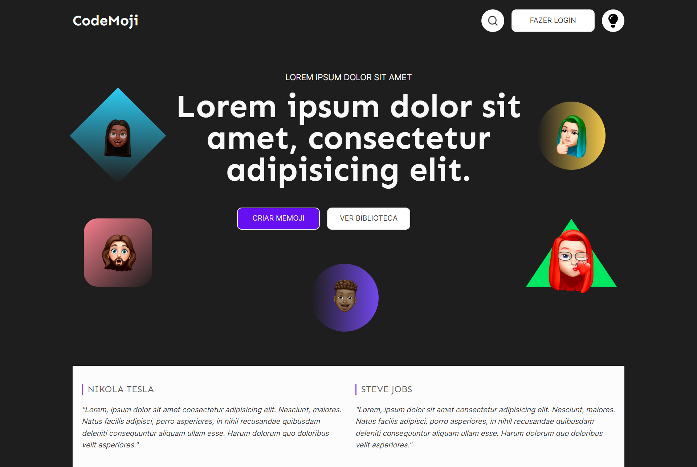

# Desafio 08 da comunidade Codelândia

Conceitos abordados no projeto:

* Transformação de um layout do Figma em código
* Não fiz o responsivo dele
* Layout claro e escuro

### [Link para conferir o resultado](https://brendacosta.github.io/desafios---Codelandia/08CodeMoji/index.html)
