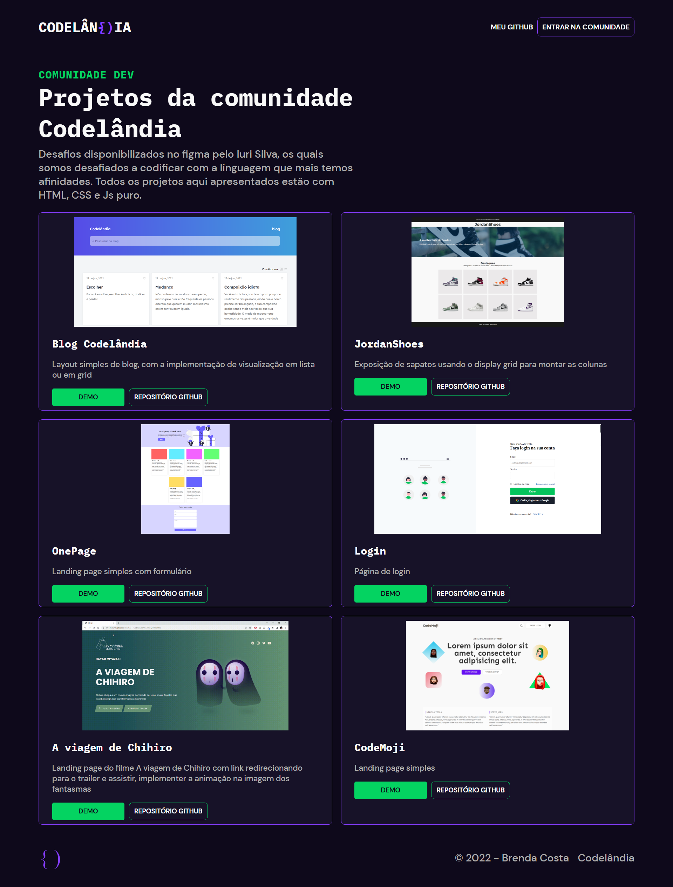

# Desafio 22 da comunidade Codelândia

Conceitos abordados no projeto:

* Transformação de um layout do Figma em código
* Responsividade

### [Link para conferir o resultado](https://brendacosta.github.io/desafios---Codelandia/22Codelandia/index.html)
