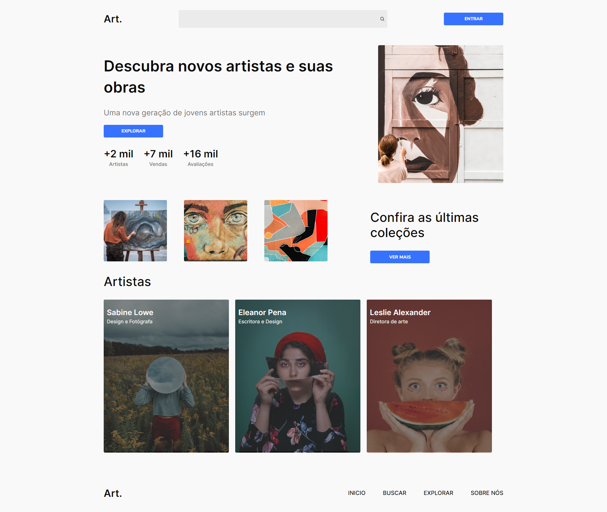

# Desafio 26 da comunidade Codelândia

Conceitos abordados no projeto:

* Transformação de um layout do Figma em código
* Media queries

### [Link para conferir o resultado](https://brendacosta.github.io/desafios---Codelandia/26Art/index.html)
